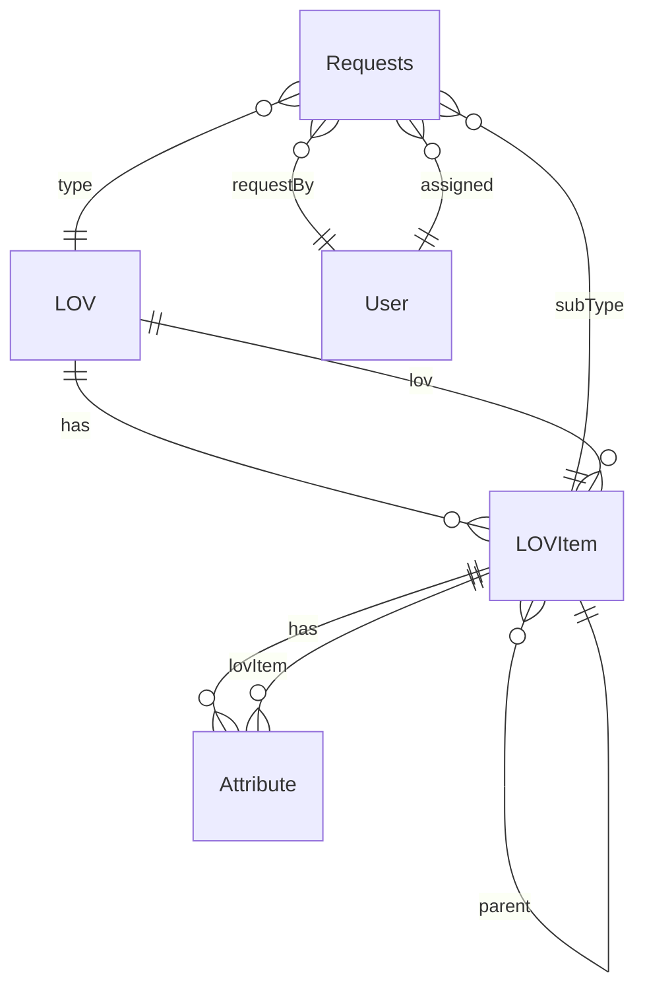
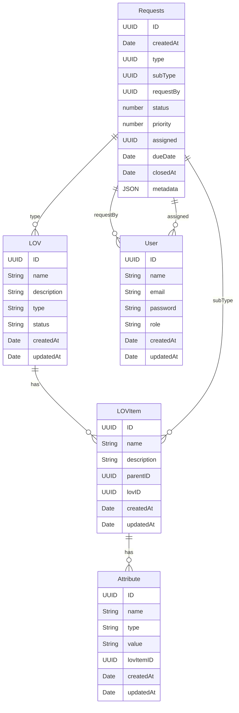
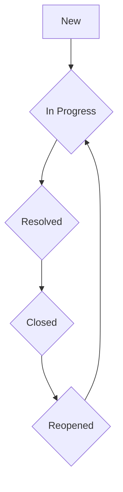
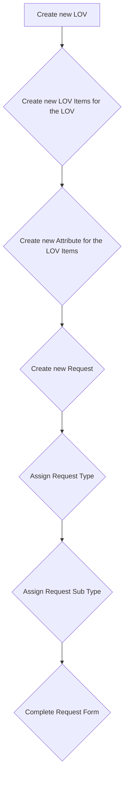

# RMS Database Design

Database design for the Request Management System (RMS).

## Tables and columns

The following tables and columns are used in the RMS.

### List of Values (LOVs)

The following tables and columns are used in the List of Values (LOVs).

| Table | Column      | Type              | Description                        |
|-------|-------------|-------------------|------------------------------------|
| LOV   | ID          | UUID              | The ID of the LOV.                 |
| LOV   | Name        | String            | The name of the LOV.               |
| LOV   | Description | String            | The description of the LOV.        |
| LOV   | Type        | String            | The type of the LOV. (To Discuss)  |
| LOV   | Status      | String            | The status of the LOV.             |
| LOV   | Items       | Array of LOV Item | The items of the LOV.              |
| LOV   | CreatedAt   | Date              | The date when the LOV was created. |
| LOV   | UpdatedAt   | Date              | The date when the LOV was updated. |

### List of Values (LOV) Items

The following tables and columns are used in the List of Values (LOV) Items.

| Table   | Column      | Type        | Description                             |
|---------|-------------|-------------|-----------------------------------------|
| LOVItem | ID          | UUID        | The ID of the LOV Item.                 |
| LOVItem | Name        | String      | The name of the LOV Item.               |
| LOVItem | Description | Description | The description of the LOV Item.        |
| LOVItem | ParentID    | UUID        | The parent of the LOV Item.             |
| LOVItem | LovID       | UUID        | The LOV ID.                             |
| LOVItem | Children    | LOVItem[]   | The parent of the LOV Item.             |
| LOVItem | Attributes  | Attribute[] | The attributes of the LOV Item.         |
| LOVItem | CreatedAt   | Date        | The date when the LOV Item was created. |
| LOVItem | UpdatedAt   | Date        | The date when the LOV Item was updated. |

### Attributes

The following tables and columns are used in the Attributes.

| Table     | Column    | Type   | Description                              |
|-----------|-----------|--------|------------------------------------------|
| Attribute | ID        | UUID   | The ID of the Attribute.                 |
| Attribute | Name      | String | The name of the Attribute.               |
| Attribute | Type      | String | The type of the Attribute.               |
| Attribute | Value     | String | The value of the Attribute.              |
| Attribute | LovItemID | UUID   | The LOV Item ID.                         |
| Attribute | CreatedAt | Date   | The date when the Attribute was created. |
| Attribute | UpdatedAt | Date   | The date when the Attribute was updated. |

### Requests

The following tables and columns are used in the Requests.

| Table    | Column    | Type   | Description                                                     |
|----------|-----------|--------|-----------------------------------------------------------------|
| Requests | ID        | UUID   | The ID of the Request.                                          |
| Requests | CreatedAt | Date   | The date when the Request was created.                          |
| Requests | Type      | UUID   | LOV ID                                                          |
| Requests | SubType   | UUID   | LOV Item ID                                                     |
| Requests | RequestBy | UUID   | User ID                                                         |
| Requests | Status    | number | Status like (Resolved, In Progress, Unresolved, Closed)         |
| Requests | Priority  | number | Priority                                                        |
| Requests | Assigned  | UUID   | User ID                                                         |
| Requests | DueDate   | Date   | Due date                                                        |
| Requests | ClosedAt  | Date   | Closed date When closed date is not null so it's not closed yet |
| Requests | Metadata  | JSON   | Metadata is a JSON object of the request form data              |

--- 

## Diagrams and schemas

### General diagram

### Schema

### States and transitions

### Develop a new Request

