# Jira Documentation

## Issue Types

- Epic: A large user story that needs to be broken down into smaller stories.
- Story: A small unit of work that can be completed in a sprint.
- Task: A unit of work that is too small to be estimated.
- Bug: A defect or an error in the system.
- Sub-Task: A unit of work that is too small to be estimated.
- UI/UX Task: A unit of work that is too small to be estimated.
- Technical Task: A unit of work that is too small to be estimated.
- Test Case: A unit of work that is too small to be estimated.
- Test Plan: A unit of work that is too small to be estimated.
- Test Suite: A unit of work that is too small to be estimated.

---

## Workflows

Workflows are used to track the status of an issue. They are a set of statuses and transitions that an issue goes through during its lifecycle.

- **Open**: The issue is open and ready to be refined.
- **Reopened**: The issue was reopened and ready to be refined.
- **Blocked/Rejected/Fail**: The issue was blocked, rejected, or failed.
- **Ready for Refinement**: The issue is ready to be refined by the product owner.
- **Ready for Development**: The issue is ready to be developed by the developer.
- **Under Development**: The issue is being developed by the developer.
- **Ready for Code Review**: The issue is ready to be code reviewed by the team lead.
- **Ready for Deployment**: The issue is ready to be deployed to staging by the team lead.
- **Ready for Testing**: The issue is ready to be tested by the tester.
- **Under Testing**: The issue is being tested by the tester.
- **Ready For Acceptance Testing**: The issue is ready to be accepted by the product owner.
- **Ready for Production**: The issue is ready to be deployed to production by the team lead.
- **Done**: The issue is done and closed.

### Workflow Transitions

Transitions are used to move an issue from one status to another. They are a set of statuses and transitions that an issue goes through during its lifecycle.

#### Open

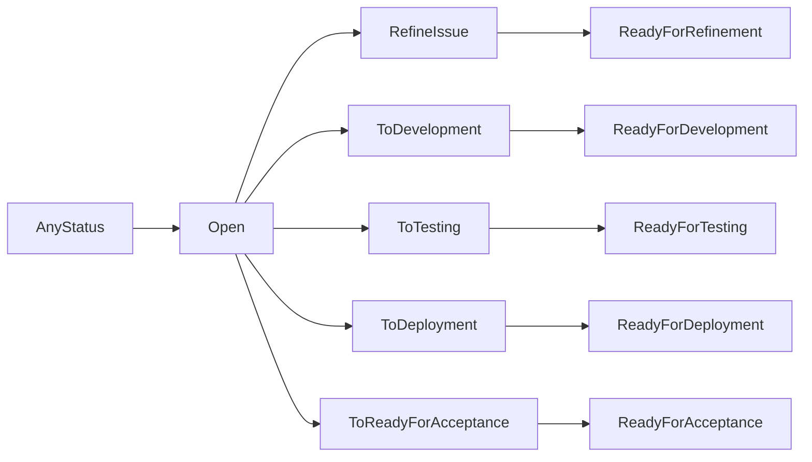

#### Reopened

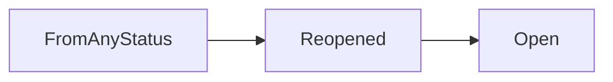

#### Blocked/Rejected/Fail

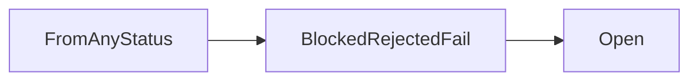

#### Ready for Refinement

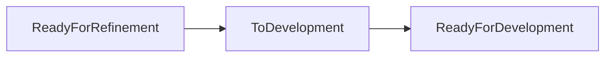

#### Ready for Development

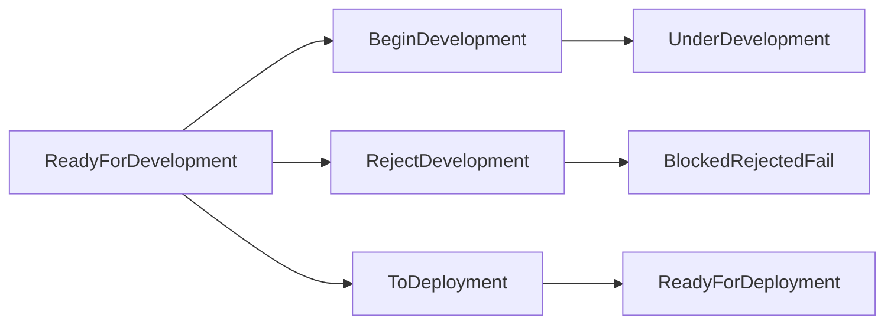

#### Under Development

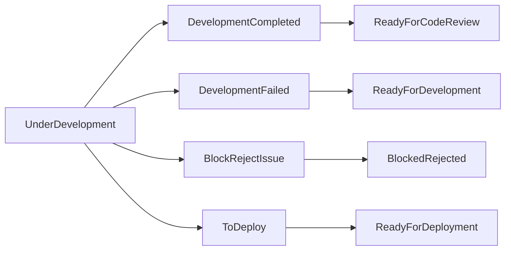

#### Ready for Code Review

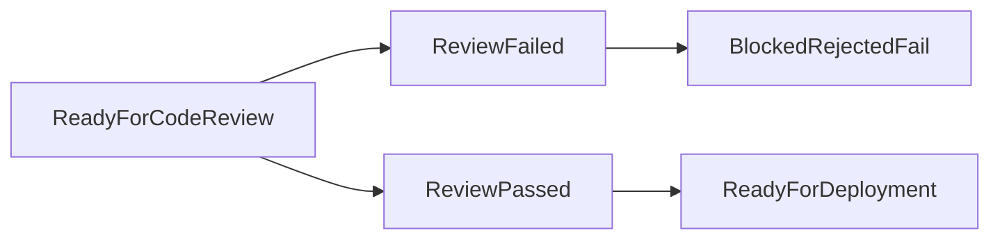

#### Ready for Deployment

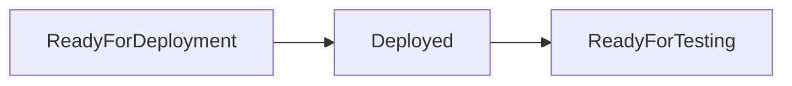

#### Ready for Testing

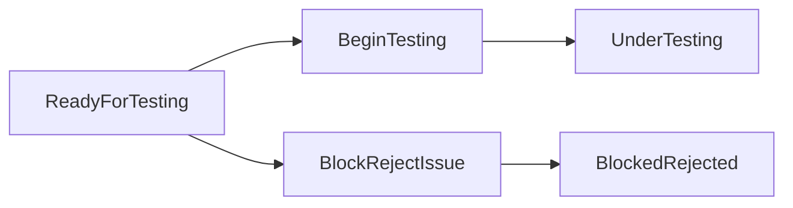

#### Under Testing

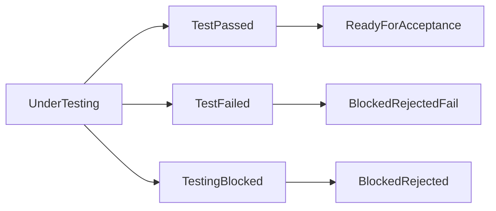

#### Ready For Acceptance

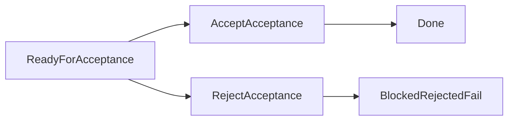

#### Ready for Production

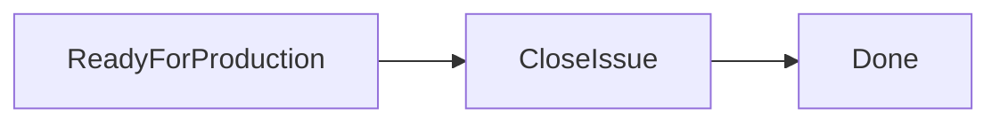

### Actions

Actions are used to perform operations on an issue, such as creating, updating, and deleting an issue. They are a set of statuses and transitions that an issue goes through during its lifecycle.

#### Create Issue

Create an issue in the project (User Story, Task, Bug, Sub-Task, UI/UX Task, Technical Task, Test Case, Test Plan, Test Suite).

- **Performers**: Product Owner, Team Lead, Developer, Tester.
- **Workflow**: Open.

#### Refine Issue

Refine an issue to make it ready for development.

- **Performers**: Product Owner.
- **From**: Open.
- **To**: Ready for refinement.
- **Steps**:
    - (Product Owner) Create a user story.
    - (Product Owner) Define the acceptance criteria.
    - (Product Owner) Send the user story to refinement.
    - (Team Lead) Estimate the story points.
    - (Team Lead) Send the user story to development.

#### To Development

Send an issue to development to make it ready for development.

- **Performers**: Team Lead.
- **From**: Open, Ready for refinement.
- **To**: Ready for development.
- **Steps**:
    - (Team Lead) Create a tasks for the user story.
    - (Team Lead) Assign the tasks to the developers.
    - (Team Lead) Send the user story to development.

#### Begin Development

Begin the development of an issue.

- **Performers**: Developer.
- **From**: Ready for development.
- **To**: Under development.
- **Steps**:
    - (Developer) Create a branch for the issue.
    - (Developer) Develop the issue.

#### Development Completed

Complete the development of an issue.

- **Performers**: Developer.
- **From**: Under development.
- **To**: Ready for code review.
- **Steps**:
    - (Developer) Create a pull request for the issue.
    - (Developer) Assign the pull request to the team lead.
    - (Developer) Send the pull request to code review.
    - (Team Lead) Review the pull request.

#### Reviewing Code

Review an issue to make it ready for deployment.

- **Performers**: Team Lead.
- **From**: Ready for code review.
- **To**: Ready for deployment.
- **Steps**:
    - (Team Lead) Review the pull request.
    - (Team Lead) On success, merge the pull request.
    - (Team Lead) On failure, send the issue to development.
    - (Team Lead) Send the issue to deployment.

#### To Deployment

Send an issue to deployment to make it ready for deployment.

- **Performers**: Team Lead.
- **From**: Open, Ready for refinement, Ready for development, Ready for code review.
- **To**: Ready for deployment.
- **Steps**:
    - (Team Lead) Create a deployment request for the issue.
    - (Team Lead) Send the issue to deployment.
    - (Team Lead) Deploy the issue to staging.
    - (Team Lead) Send the issue to testing.

#### To Testing

Send an issue to testing to make it ready for testing.

- **Performers**: Team Lead.
- **From**: Ready for deployment.
- **To**: Ready for testing.
- **Steps**:
    - (Team Lead) Create a testing request for the issue.
    - (Team Lead) Assign the issue to the tester.

#### Begin Testing

Begin the testing of an issue.

- **Performers**: Tester.
- **From**: Ready for testing.
- **To**: Under testing.
- **Steps**:
    - (Tester) Test the issue.
    - (Tester) On success, send the issue to acceptance.
    - (Tester) On failure, send the issue to blocked/rejected/fail.

#### Accept Acceptance

Accept an issue to make it ready for production.

- **Performers**: Product Owner.
- **From**: Ready for acceptance.
- **To**: Done.
- **Steps**:
    - (Product Owner) Accept the issue.
    - (Product Owner) Send the issue to production

#### To Production

Send an issue to production to make it ready for production.

- **Performers**: Team Lead.
- **From**: Ready for acceptance.
- **To**: Ready for production.
- **Steps**:
    - (Team Lead) Create a deployment request for the issue.
    - (Team Lead) Send the issue to production.
    - (Team Lead) Deploy the issue to production.
    - (Team Lead) Send the issue to done.

##S## Close Issue

Close an issue to make it ready for production.

- **From**: Ready for production.
- **To**: Done.
- **Steps**:
    - (Team Lead) Close the issue.

--- 

## Configurations

### Components

Components are used to group issues within a project. They are a set of statuses and transitions that an issue goes through during its lifecycle.

- **Frontend**: Mobile application or web application.
- **Backend**: API or database.
- **Portal**: Project portal.
- **DevOps**: DevOps related issues.
- **UI/UX**: UI/UX related issues.
- **Testing**: Testing related issues.
- **Documentation**: Project documentation.
- **Research**: Research related issues.
- **Security**: Security related issues.
- **Performance**: Performance related issues.
- **Accessibility**: Accessibility related issues.
- **Localization**: Localization related issues.

More components can be added to the default components.

### Labels

Labels are used to group issues within a project. They are a set of statuses and transitions that an issue goes through during its lifecycle.

- **Bug**: A defect or an error in the system.
- **Duplicate**: A duplicate issue.
- **Enhancement**: An enhancement to the system.
- **Help Wanted**: Help is wanted for this issue.
- **Invalid**: An invalid issue.
- **Question**: A question.
- **Wontfix**: This issue will not be fixed.

### Fields

Fields are used to store information about an issue. They are a set of statuses and transitions that an issue goes through during its lifecycle.

#### Epic

- **Epic Name**: The name of the epic.
- **Epic Description**: The description of the epic.
- **Epic Status**: The status of the epic.
- **Epic Assignee**: The assignee of the epic.
- **Epic Reporter**: The reporter of the epic.
- **Epic Priority**: The priority of the epic.
- **Epic Labels**: The labels of the epic.
- **Epic Components**: The components of the epic.
- **Epic Due Date**: The due date of the epic.
- **Epic Progress**: The progress of the epic.

#### Story

- **Story Name**: The name of the story.
- **Story Description**: The description of the story.
- **Story Status**: The status of the story.
- **Story Assignee**: The assignee of the story.
- **Story Reporter**: The reporter of the story.
- **Story Priority**: The priority of the story.
- **Story Labels**: The labels of the story.
- **Story Components**: The components of the story.
- **Story Due Date**: The due date of the story.
- **Story Progress**: The progress of the story.
- **Story Epic**: The epic of the story.
- **Story Points**: The story points of the story.
- **Story Sprint**: The sprint of the story.

#### Task

- **Task Name**: The name of the task.
- **Task Description**: The description of the task.
- **Task Status**: The status of the task.
- **Task Assignee**: The assignee of the task.
- **Task Reporter**: The reporter of the task.
- **Task Priority**: The priority of the task.
- **Task Labels**: The labels of the task.
- **Task Components**: The components of the task.
- **Task Due Date**: The due date of the task.
- **Task Points**: The story points of the task.
- **Task Sprint**: The sprint of the task.
- **Task Story**: The story of the task.
- **Task Sub-Tasks**: The sub-tasks of the task.
- **Task Test Cases**: The test cases of the task.
- **Task Test Plans**: The test plans of the task.
- **Task Test Suites**: The test suites of the task.

#### Bug

- **Bug Name**: The name of the bug.
- **Bug Description**: The description of the bug.
- **Bug Status**: The status of the bug.
- **Bug Assignee**: The assignee of the bug.
- **Bug Reporter**: The reporter of the bug.
- **Bug Priority**: The priority of the bug.
- **Bug Labels**: The labels of the bug.
- **Bug Components**: The components of the bug.
- **Bug Due Date**: The due date of the bug.
- **Bug Sprint**: The sprint of the bug.
- **Bug Story**: The story of the bug.
- **Bug Sub-Tasks**: The sub-tasks of the bug.
- **Bug Severity**: The severity of the bug.
- **Bug Environment**: The environment of the bug.
- **Bug Steps to Reproduce**: The steps to reproduce the bug.
- **Bug Expected Result**: The expected result of the bug.
- **Bug Actual Result**: The actual result of the bug.
- **Bug Attachment**: The attachment of the bug.

#### Sub-Task

- **Sub-Task Name**: The name of the sub-task.
- **Sub-Task Description**: The description of the sub-task.
- **Sub-Task Status**: The status of the sub-task.
- **Sub-Task Assignee**: The assignee of the sub-task.
- **Sub-Task Reporter**: The reporter of the sub-task.

#### UI/UX Task

- **UI/UX Task Name**: The name of the UI/UX task.
- **UI/UX Task Description**: The description of the UI/UX task.
- **UI/UX Task Status**: The status of the UI/UX task.
- **UI/UX Task Assignee**: The assignee of the UI/UX task.
- **UI/UX Task Reporter**: The reporter of the UI/UX task.

#### Technical Task

- **Technical Task Name**: The name of the technical task.
- **Technical Task Description**: The description of the technical task.
- **Technical Task Status**: The status of the technical task.
- **Technical Task Assignee**: The assignee of the technical task.
- **Technical Task Reporter**: The reporter of the technical task.
- **Technical Task Story**: The story of the technical task.
